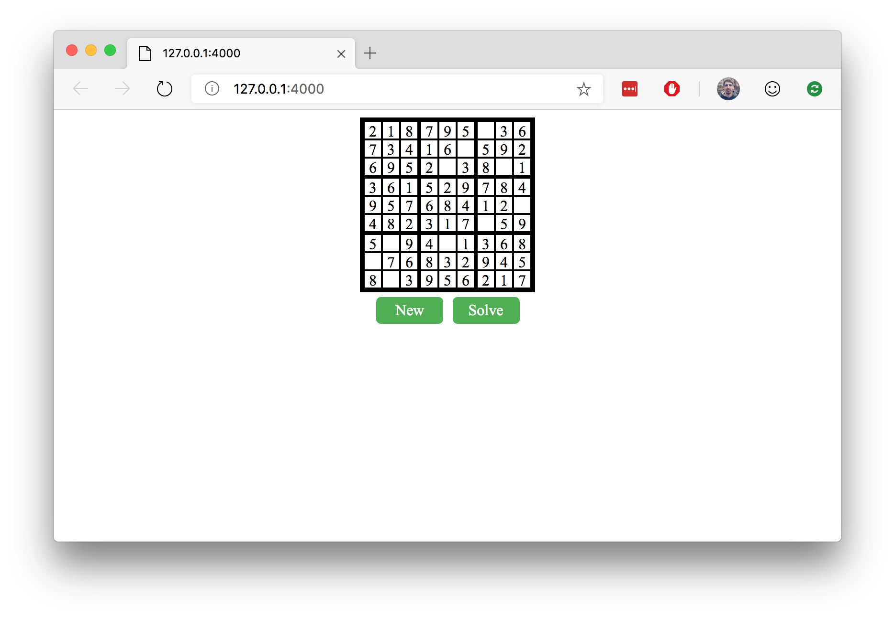

# Putting It All Together

While so far we've been focusing on Rust's interactions with JavaScript, you don't have to write very much JavaScript if you don't want to. You can instead call JavaScript and DOM apis from within Rust using the [js-sys](https://crates.io/crates/js-sys) and [web-sys](https://crates.io/crates/web-sys) crates.

## The Challenge

In this challenge, you'll be taking an existing Rust library and expanding it to be used from JavaScript just like before. However, this time the Rust code will be doing the heavy lifting of manipulating the DOM.

Inside of the [workspace](./workspace) directory, you'll find some HTML, JavaScript, and CSS files as well as a Rust library called rustdoku. This is a library for generating and solving sudoku puzzles. We'll expand the library to generate a sudoku board with two buttons: one for reseting the puzzle to a new random puzzle and one for solving the puzzle. In the end we'll end up with an app that looks like the following:

## Some Things to Know

If you've never created DOM elements from JavaScript before, you'll need to know a few APIs:

* [document.createElement](https://developer.mozilla.org/en-US/docs/Web/API/Document/createElement)
* [document.createTextNode](https://developer.mozilla.org/en-US/docs/Web/API/Document/createTextNode)
* [element.id=](https://developer.mozilla.org/en-US/docs/Web/API/Element/id)
* [element.className=](https://developer.mozilla.org/en-US/docs/Web/API/Element/className)
* [node.appendChild](https://developer.mozilla.org/en-US/docs/Web/API/Node/appendChild)
* [eventTarget.addEventListener](https://developer.mozilla.org/en-US/docs/Web/API/EventTarget/addEventListener)

You should be able to find equivalent's to these functions and methods inside of the [web-sys documentation](https://rustwasm.github.io/wasm-bindgen/api/web_sys). There are, however, a few things to be aware of. Rust uses a different naming convention than JavaScript and web-sys follows Rust's convention of snake_case. Rust does not have method overloading like JavaScript so if the function can take different types of arguments, this is translated to completely different functions in Rust. Lastly, Rust does not support inheritance. To simulate the inheritance in JavaScript, web-sys uses [`AsRef`](https://doc.rust-lang.org/std/convert/trait.AsRef.html) to automatically coerce subtypes into super types.

The most difficult part of this challenge is how to handle the callbacks for when the user clicks the button. First, take a look at the reference on [using closures from wasm-bindgen](https://rustwasm.github.io/docs/wasm-bindgen/examples/closures.html) to get a better understanding of how to use them. You may find issues with lifetimes when trying to implement this. Don't be afraid to reach for some smart pointers like [`Rc`](https://doc.rust-lang.org/std/rc/struct.Rc.html
) and [`RefCell`](https://doc.rust-lang.org/std/cell/struct.RefCell.html) to help you out.

## Some Resources

* The [wasm-bindgen documentation](https://rustwasm.github.io/docs/wasm-bindgen/examples/wasm-in-wasm.html) has documentation on web-sys and js-sys.

## Exercises

1.) Try to take the app further by enabling editing of the sudoku board.
2.) Look into Rust and WebAssembly frameworks to make working on the app a bit easier. Some frameworks include [Yew](https://github.com/DenisKolodin/yew/blob/master/Cargo.toml), [Sauron](https://github.com/ivanceras/sauron), and [Seed](https://github.com/David-OConnor/seed). 

